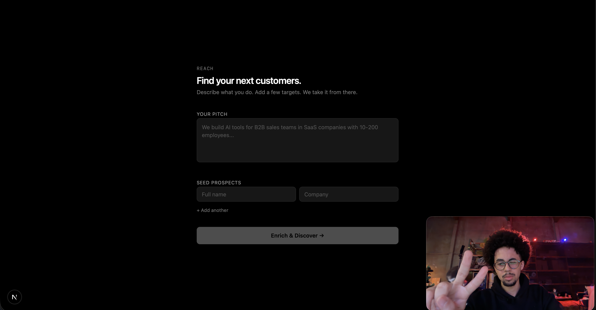

# Reach CRM



An AI-powered B2B prospect research tool. Give it your pitch and a few target names — it autonomously researches each person across the open web and returns enriched profiles ready to act on.

## What it does

1. You enter your company pitch and a list of seed prospects (name + company)
2. The pipeline enriches each prospect: role, summary, email, phone, company info, recent mentions
3. Results appear in real-time in a self-updating dashboard

## Stack

- **Next.js 16** (App Router) — frontend + API routes
- **MongoDB Atlas** — stores runs and prospect data
- **Kernel** (`@onkernel/sdk`) — Browser-as-a-Service, spins up headless browser sessions
- **Lightcone / Northstar** (`@tzafon/lightcone`) — CUA (Computer-Use Agent) that drives the browser via `computer_use_preview` tool
- **Kimi K2 (Azure)** — LLM for ICP extraction and prospect scoring
- **Mistral** — LLM for email draft generation
- **Tailwind CSS** — minimal dark UI (Vercel-style)

## How the CUA loop works

Each prospect gets its own Kernel browser session. Lightcone takes a screenshot, decides the next action (click, type, scroll, navigate), executes it on Kernel, and repeats until it has enough data to return a JSON profile. Coordinates are normalized (0–999) by Northstar and denormalized to actual pixels before being sent to Kernel.

## Challenges

- **LinkedIn walls**: Initial approach tried to automate LinkedIn login (including Gmail 2FA retrieval). Abandoned — too fragile. Switched entirely to open-web research (Google + public pages).
- **CUA loop stability**: The model sometimes narrates without taking action, causing infinite loops. Fixed with a `narratingStreak` counter (exits after 5 consecutive non-action turns).
- **Coordinate system mismatch**: Northstar returns 0–999 normalized coords; Kernel expects pixel coords. Required a `denorm(v, dim)` conversion step.
- **SDK type mismatches**: Lightcone's TypeScript types didn't match the actual API at runtime (tool type `"computer_use"` vs `"computer_use_preview"`, screenshot output type). Required strategic `as never` casts.
- **Screenshot format**: Kernel's `captureScreenshot` returns a binary Fetch `Response`, not a Buffer — required `Buffer.from(await res.arrayBuffer())`.

## Setup

```bash
cp .env.local.example .env.local  # fill in your keys
npm install
npm run dev
```

Required env vars: `LIGHTCONE_API_KEY`, `KERNEL_API`, `MONGODB_URI`, `AZURE_URI`, `AZURE_KEY`, `AZURE_MODEL`, `MISTRAL_API_KEY`.
